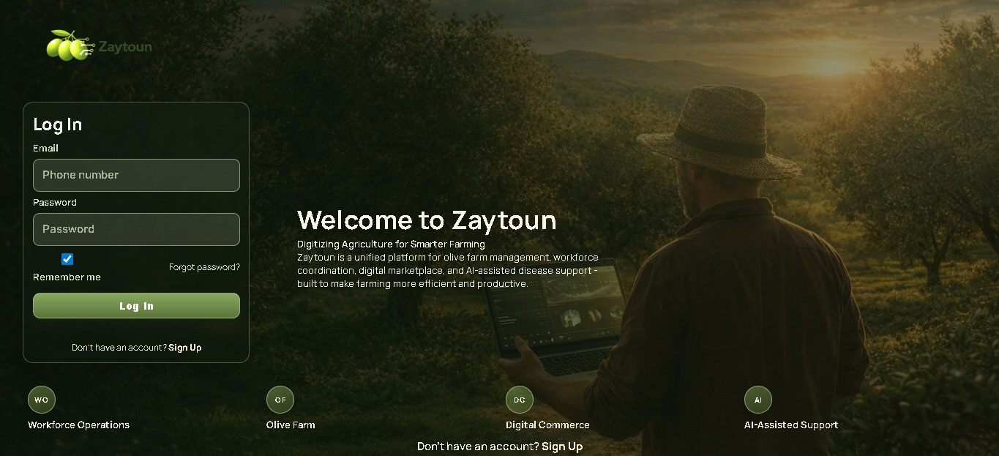

# Zaytoun Platform

Zaytoun is a production-minded agricultural platform that unifies workforce operations, olive farm management, digital commerce, and AI-assisted disease support in one system.

## Product Preview



## My Why

This platform was built from my love for my land, shaped by my real experience as a farmer, and driven by the urgent need for digitization in agriculture. I created Zaytoun to bring practical, modern tools to farmers and agricultural workers, so daily operations become easier, decisions become smarter, and rural work gains the efficiency and visibility it deserves.

This repository demonstrates a complex real-world integration challenge:
- multi-role business workflows (`worker`, `farmer`, `customer`)
- transactional operations (bookings, market orders, ratings, messaging)
- farm-domain planning and finance tracking (olive seasons, labor, inventory, sales)
- secure AI microservice integration (farmer-only Agro Copilot with backend proxy and service-to-service key)

## Why This Project Matters

Most projects solve one isolated problem. Zaytoun solves an ecosystem problem.

It handles:
- labor supply and demand matching
- farm-season planning and operational accounting
- marketplace conversion from production to customer orders
- AI-assisted agronomy support for field decisions

The platform is intentionally built to be useful now while already prepared for scale-up and deployment hardening.

## System Highlights

### 1) Role-driven platform design
- JWT auth and role-based access controls
- strict ownership rules for worker/farmer/customer data
- explicit legal-consent enforcement at authentication boundaries (terms + data consent)
- production-style auth UX with role-specific signup entry points and password reset flow
- protected farmer-only AI endpoints via backend authorization

### 2) End-to-end operational depth
- worker profiles, filtering, map/location-aware discovery
- booking lifecycle with status transitions, negotiation, and timeline events
- olive season management with labor, sales, usage, inventory carry-over, and insights

### 3) Commerce workflows
- farmer storefront management
- customer browsing, cart and ordering
- farmer validation, pickup flow, order messaging
- separable product and store ratings

### 4) AI integration done professionally
- Agro Copilot integrated as a dedicated service
- backend proxy layer (`/agro-copilot/*`) to enforce business access policy
- internal service key support (`INTERNAL_API_KEY` / `AGRO_COPILOT_API_KEY`)
- deploy wiring for Render + Docker Compose + CI validation

## Authentication & Security Engineering

This project includes a production-style authentication implementation designed around real operational risk, not demo-only login forms.

- **Identity model:** phone-first login (`phone + password`) with optional recovery email, supporting real user behavior in rural/agri contexts.
- **Legal compliance controls:** explicit Terms and Data Consent acceptance at registration/login, plus consent-version enforcement and re-acceptance flow when policy versions change.
- **Session security:** JWT-based authentication with role claims and **token versioning**; password changes and password resets invalidate previous sessions immediately.
- **Sensitive-action hardening:** changing critical account data (phone/email) requires re-auth via current password challenge.
- **Recovery flow:** secure forgot-password implementation with one-time reset code hashing, expiry windows, invalid-attempt limits, and SMTP email delivery support.
- **Account security center:** dedicated settings workflows for profile updates, password rotation, legal access, recovery-code request, direct reset-form navigation, and controlled account deletion.
- **Authorization boundaries:** strict role and ownership checks across API surfaces (worker/farmer/customer), enforced server-side.
- **Tested behavior:** automated backend tests validate auth happy paths, consent re-acceptance, password reset controls, session invalidation, and account settings security rules.

This auth layer was intentionally built as a reusable foundation for scale-up (rate limiting, audit events, device/session management) rather than a one-off MVP patch.

## Current Stage

**Stage: Advanced MVP / Pre-Production Integration**

What is already strong:
- complete core feature loops across labor, farm operations, market, and AI support
- test coverage on key backend business flows
- CI/CD pipeline and deployment blueprints
- production-style auth boundaries and service separation

What is next for full production scale:
- observability (metrics, tracing, dashboards)
- rate limiting and abuse protection policies
- load testing and performance tuning under concurrency
- stronger reliability controls (queueing/circuit breaker where needed)

## Architecture

- **Backend:** FastAPI + SQLAlchemy + Alembic
- **Frontend:** Vite multi-page app (vanilla JS modules)
- **Database (local):** SQLite
- **Production target:** PostgreSQL/Supabase
- **AI Service:** Agro Copilot (FastAPI), proxied by backend
- **Deployment:** Render + Docker Compose + GitHub Actions CI/CD

## Repository Structure

- `backend/` main API, models, migrations, tests
- `frontend/` web app pages, modules, UI assets
- `Agro-copilot/` olive disease assistant service (integrated into main platform)
- `deploy/` production compose and deployment docs

## Local Run (Quick)

### 1) Agro Copilot
```powershell
cd Agro-copilot
.\.venv\Scripts\python -m uvicorn backend.app.main:app --host 127.0.0.1 --port 8001
```

### 2) Backend
```powershell
cd backend
.\.venv\Scripts\python -m uvicorn app.main:app --host 127.0.0.1 --port 8000
```

### 3) Frontend
```powershell
cd frontend
$env:VITE_API_BASE_URL="http://127.0.0.1:8000"
npm.cmd run dev
```

Open: `http://127.0.0.1:5173`

## Frontend Page Map

- `index.html` -> landing + login
- `signup.html` -> role-aware account creation
- `forgot-password.html` -> reset flow (`request code` + `confirm new password`)
- `consent.html` -> mandatory consent re-acceptance
- `workers.html` -> worker directory, filtering, and booking launch
- `register.html` -> worker/team registration
- `bookings.html` -> booking management and status workflow
- `market.html` -> storefront, listings, cart/orders
- `olive-season.html` -> season operations, labor/sales/usage/inventory views
- `settings.html` -> profile/security/legal/delete controls
- `agro-copilot.html` -> farmer-only AI assistant UI

## Password & Recovery Workflow (Current UX)

### While logged in (Settings)
- Change password directly from **Settings -> Security** using current password.
- Request a recovery code from **Settings -> Security -> Send Recovery Code (Forgot Password)**.
- Jump to reset page via **Open Reset Form** (phone is prefilled).

### Forgot-password flow (public page)
- Go to `forgot-password.html`.
- Step 1: request code with phone.
- Step 2: submit phone + reset code + new password.
- Reset code is delivered to the **Recovery Email** saved in profile.

### Important behavior
- Password change and password reset both rotate token version and invalidate old sessions.
- Recovery-code request requires phone, and meaningful API error text is surfaced in UI.

## Local Testing

### Frontend build check
```powershell
cd frontend
npm.cmd run build
```

### Backend auth tests (examples)
```powershell
$env:PYTHONPATH="backend"
backend\.venv\Scripts\pytest -q backend/tests/test_auth_settings.py backend/tests/test_auth_password_reset.py
```

If tests fail with `sqlite3.OperationalError: unable to open database file`, verify local DB path/env setup before rerunning.
